<div align="center">


# Moriva — L'espresso, élevé en art

**A 3D, scroll-driven e-commerce experience and full business back-office for Norlyn Coffee's Moriva espresso capsules.**

[**Live site → norlyncoffee.com**](https://www.norlyncoffee.com)


<br />

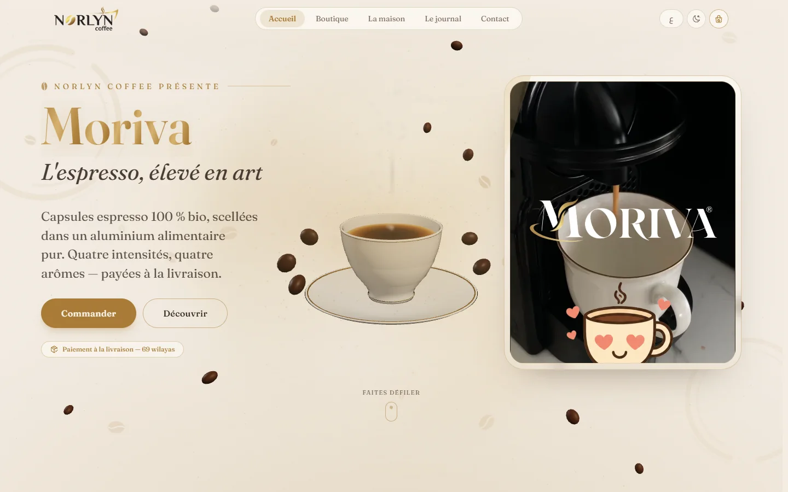

</div>

---

## Overview

**Moriva** is the premium espresso-capsule line of **Norlyn Coffee**, an
Algiers-based roaster. The collection is two families of four: **Espresso
100 % bio** (Or, Vert, Brun, Noir, ordered by intensity) and **Capsules
aromatisées** (noisette, vanille, caramel, chocolat). All are sealed in pure
food-grade aluminium.

This project is the brand's complete digital platform:

- **A storefront** built as a cinematic, scroll-driven 3D experience that
  still behaves like a fast and practical shop, with cash-on-delivery checkout
  across all **69 wilayas** of Algeria.
- **An admin back-office** that runs the business: catalogue, orders,
  delivery pricing, content, marketing pixels, staff permissions, and two
  separate financial ledgers (online store and physical shop).
- **Three languages**: French, Arabic (full RTL) and English. Light and dark
  themes are both designed, not just inverted.

## Design concept

> *"L'espresso, élevé en art"* — espresso, elevated to an art.

The design treats buying coffee like a tasting ritual rather than a catalogue
scan. The visitor scrolls through the brand the way you'd move through a
tasting bar:

- **One object, one story.** A single procedurally built 3D object leads the whole
  landing page. It starts as a steaming espresso cup, morphs into a Moriva
  capsule, and **recolours for each variant** (gold for *Or*, green for
  *Vert*, chocolate for *Brun*, black for *Noir*) while the copy, intensity
  meter and price change beside it. The product *is* the interface.
- **A warm, tactile palette.** Cream paper tones, espresso browns and a
  brushed-gold gradient taken from the capsule foil, set in the *Fraunces*
  variable serif (with *Cairo* for Arabic). The effect is closer to
  specialty-coffee packaging than a generic shop template.
- **A character with feelings.** A hand-drawn cup mascot follows the reader
  through tagged sections and changes expression with the story (curious,
  delighted, in love). Its nine frames share one body, so an expression change
  is a cross-fade, not a sticker swap.
- **Motion with restraint.** Scroll-scrubbed reveals, drifting coffee beans
  and gentle tilt all follow the reader's pace, never a timer. Reduced-motion
  and data-saver visitors get the same layout, calm and static.
- **Mobile is its own composition.** Phones don't get a squeezed desktop: the
  3D object moves above the copy, the choreography is re-timed for a narrow
  column, and render quality adapts to the device.

## Screenshots

### Desktop

<table>
  <tr>
    <td width="50%">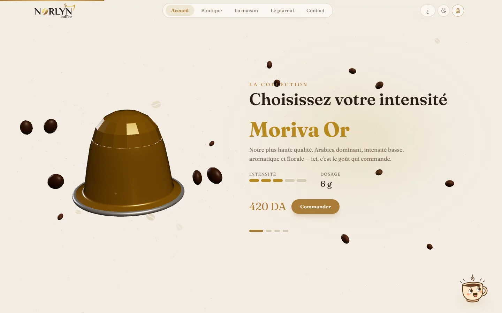</td>
    <td width="50%">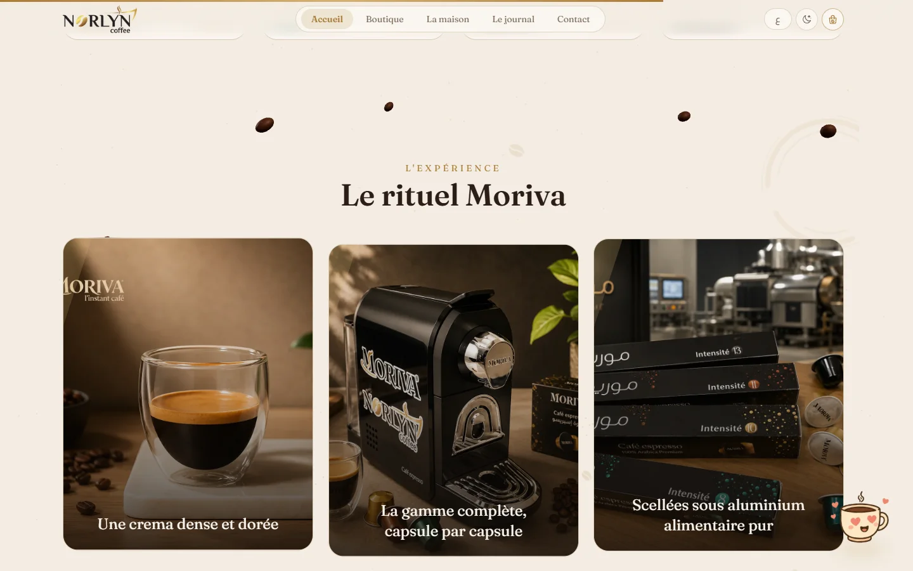</td>
  </tr>
  <tr>
    <td align="center"><sub>Scroll-driven collection: the capsule recolours per intensity</sub></td>
    <td align="center"><sub>“Le rituel Moriva” editorial section</sub></td>
  </tr>
  <tr>
    <td>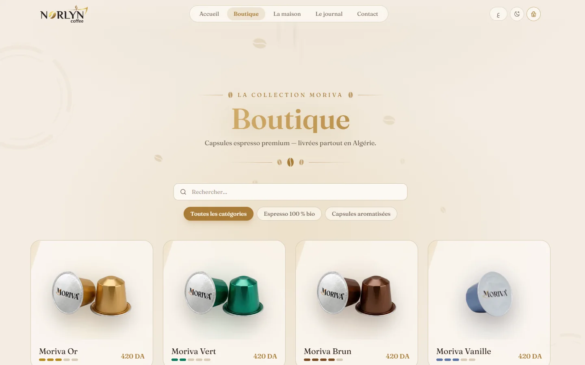</td>
    <td>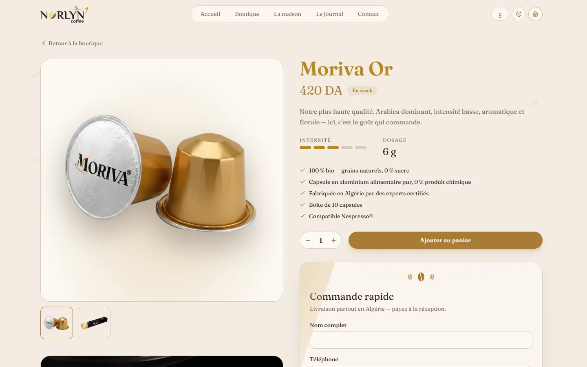</td>
  </tr>
  <tr>
    <td align="center"><sub>Shop with search and category filters</sub></td>
    <td align="center"><sub>Product page with one-step cash-on-delivery quick order</sub></td>
  </tr>
  <tr>
    <td>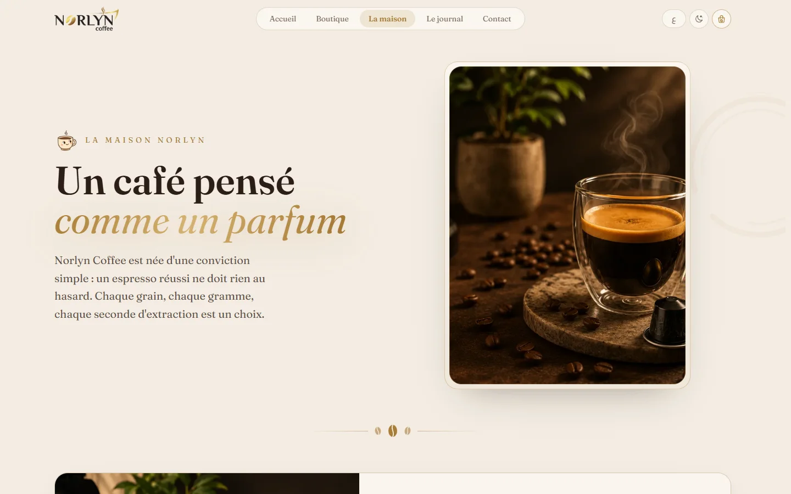</td>
    <td>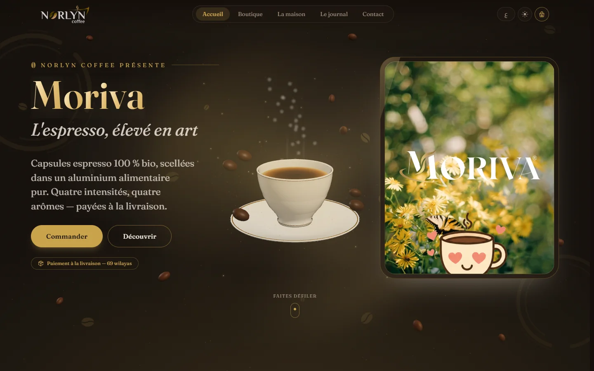</td>
  </tr>
  <tr>
    <td align="center"><sub>La Maison: the brand story</sub></td>
    <td align="center"><sub>Dark “espresso” theme</sub></td>
  </tr>
</table>

### Mobile

<table>
  <tr>
    <td align="center">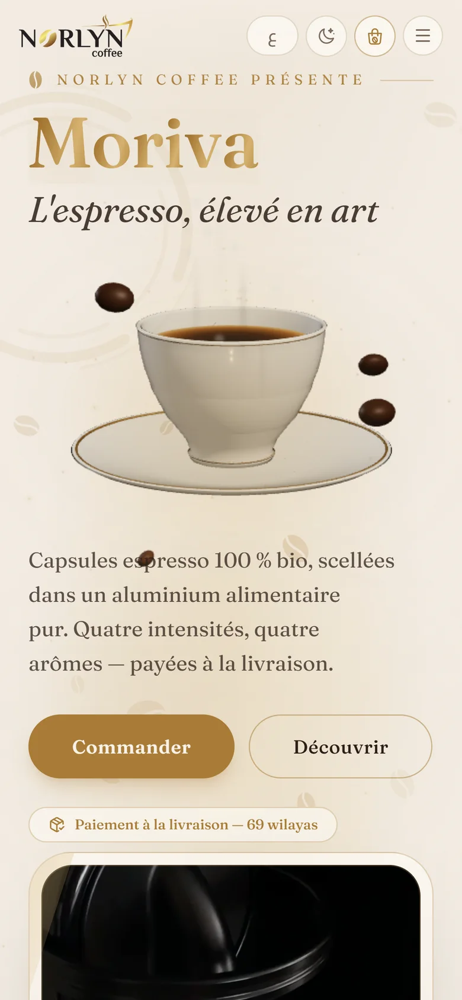<br /><sub>Hero</sub></td>
    <td align="center">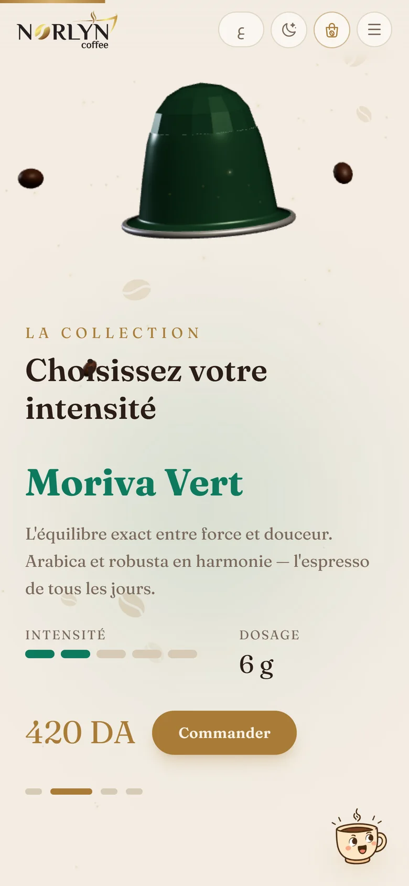<br /><sub>3D collection</sub></td>
    <td align="center">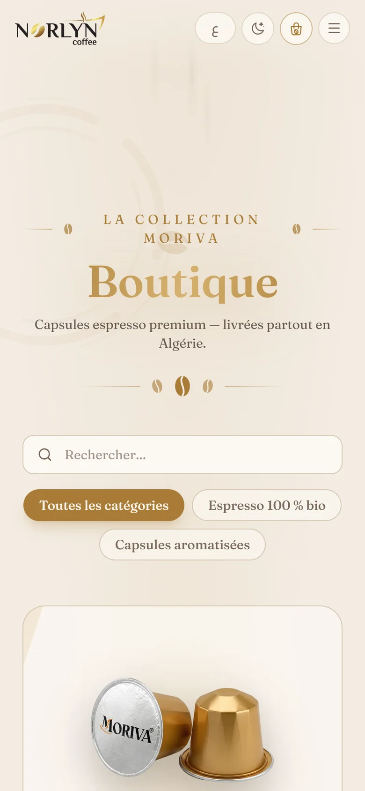<br /><sub>Shop</sub></td>
  </tr>
  <tr>
    <td align="center">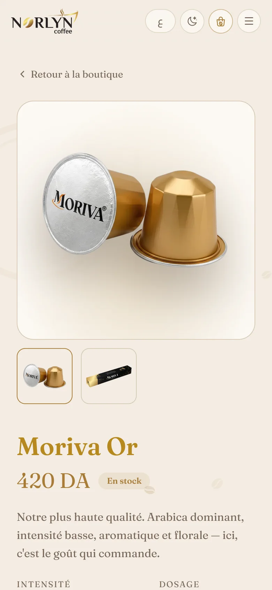<br /><sub>Product</sub></td>
    <td align="center">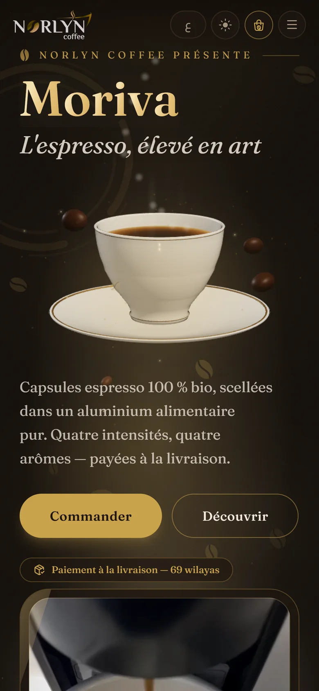<br /><sub>Dark theme</sub></td>
    <td align="center">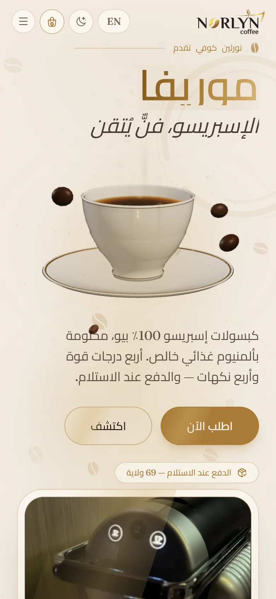<br /><sub>Arabic (RTL)</sub></td>
  </tr>
</table>

## Features

### Storefront

- Scroll-choreographed 3D landing page (React Three Fiber + GSAP ScrollTrigger + Lenis smooth scroll)
- Shop with live search and category filters; product pages with gallery, intensity/dosage specs and a looping espresso film
- Cart drawer plus a **one-step quick order** directly on each product page
- **Cash-on-delivery checkout** with per-wilaya delivery pricing for all 69 wilayas, home or pickup-office delivery
- Guest order confirmation page, retrievable by order number
- Journal (blog), La Maison (brand story), contact form, newsletter and customer reviews
- French / Arabic / English with complete right-to-left support, plus light and dark themes that remember the visitor's choice

### Admin back-office

- **Catalogue**: products, categories, stock, photos and videos, with a separate English field for each translated text
- **Orders**: status workflow, automatic restock on cancel, Excel export
- **Content & media**: hero slider, named image and video slots, journal articles, all editable without a redeploy
- **Marketing**: several Meta Pixels, each run from the admin and scoped to its own pages; newsletter subscribers; reviews moderation
- **Team**: staff accounts with **per-section permissions enforced in the database**, not just hidden in the UI
- **Business suite**: website revenue and profit dashboards (booked vs. delivered), purchase-cost snapshots per order line, and a separate ledger and point-of-sale till for the physical shop
- **Notifications**: staff are alerted to every new order and contact message

## Tech stack

| Layer | Technology |
| --- | --- |
| Framework | React 19, TypeScript (strict), Vite |
| Styling | Tailwind CSS v4 with theme tokens (light / dark) |
| 3D & motion | Three.js, React Three Fiber, drei, GSAP ScrollTrigger, Lenis, Framer Motion |
| State & data | Zustand (cart), TanStack Query (server state) |
| Forms & validation | react-hook-form + Zod |
| Routing | React Router 7, route-level code splitting |
| Backend | Supabase: PostgreSQL, Row-Level Security, Auth, Storage, Edge Functions (Deno) |
| Hosting | Vercel (static SPA + Edge Middleware) |
| Tooling | Bun, ESLint, sharp image pipeline, ffmpeg video pipeline |

## Performance

- **3D only where it pays off.** The ~240 kB (gzip) Three.js scene is a lazily
  loaded chunk that only the landing page requests. Visitors with *reduced
  motion* or *data saver* turned on (or on a 2G connection) never download it
  and see a static layout instead.
- **Zero-re-render animation.** Scroll progress is written to a plain module
  store and read inside the render loop, so the 3D choreography never
  triggers a React render.
- **Route-level code splitting.** Every secondary page and the entire admin app
  are separate chunks that shoppers only download when they visit them.
- **Image pipeline.** About 115 MB of original photography is compressed to
  about 3.5 MB of responsive WebP. Every image has a capped `srcset` and
  explicit dimensions (no layout shift), and loads lazily by default.
- **Self-hosted variable fonts.** No third-party font requests and no
  render-blocking round-trips.
- **Aggressive caching.** Hashed build assets are `immutable` for a year;
  images, videos and icons use `stale-while-revalidate`.
- **Loading tied to real readiness.** The splash screen lifts when fonts, the
  catalogue and the first WebGL frame are actually ready, not after a fixed
  timer. The layout is then measured once, so nothing jumps after the reveal.
- **No theme or language flash.** A tiny hash-allowed pre-paint script applies
  the saved theme, `lang` and `dir` before first paint.

## Security

- **Server-side pricing.** Orders are placed through a `SECURITY DEFINER`
  PostgreSQL function that recomputes every price, delivery fee and discount
  from the database, validates stock and the wilaya, and ignores anything the
  browser claims.
- **Abuse protection.** Per-phone rate limits and a global burst breaker on
  orders, a throttled newsletter endpoint, and 10-character unguessable order
  numbers for guest lookups.
- **Row-Level Security on every table.** Staff permissions are checked in the
  database per admin section, so a worker's session can't read or write
  outside the sections granted to them, even through direct API calls. Public
  sign-up is disabled.
- **Privileged keys stay server-side.** The service-role key is only used
  inside Supabase Edge Functions (staff creation, notifications), and the
  notification claims can't be replayed.
- **Hardened HTTP headers.** A strict Content-Security-Policy with no
  `unsafe-inline` scripts (the single inline script is pinned by its SHA-256
  hash), HSTS with preload, `X-Frame-Options`, `nosniff`, a locked-down
  `Permissions-Policy` and a strict referrer policy.
- **Storage uploads are admin-only**, and customer pages (checkout and order
  confirmation) are `noindex` and disallowed in `robots.txt`.
- **No secrets in source.** Configuration comes from environment variables,
  `.env` files are git-ignored, and Meta Pixel IDs are loaded from the database
  at runtime instead of being inlined.

## SEO

- **Per-route metadata.** Title, description, canonical URL, Open Graph and
  Twitter tags are set for every page.
- **Structured data.** JSON-LD `Product` + `Offer` on product pages and
  `Article` on journal posts, for rich results.
- **Rich link previews.** A Vercel Edge Middleware serves pre-rendered Open
  Graph tags to social crawlers (Facebook, WhatsApp, Telegram, X, LinkedIn,
  Discord and more) for product and article links. It answers in Arabic when
  the crawler asks for it.
- **Automatic sitemap.** `sitemap.xml` is regenerated on every build from the
  live catalogue and journal, and `robots.txt` keeps admin and customer pages
  out of the index.
- **International & accessible markup.** The `lang` and `dir` attributes are
  correct per language, the HTML is semantic, and images carry descriptive alt text.
- **Core Web Vitals.** The performance work above (no layout shift,
  lightweight first load, cached assets) also counts toward ranking.

## Project structure

```
├── src/
│   ├── pages/            # Storefront routes + admin/ back-office
│   ├── components/       # UI, layout, 3D scene, mascot, effects
│   ├── hooks/            # Scroll stage, scroll FX, SEO, data hooks
│   ├── lib/              # Pricing display, media, i18n helpers, finance engine
│   ├── i18n/             # FR / AR / EN translations (compiler-enforced parity)
│   └── store/            # Zustand stores
├── supabase/
│   ├── migrations/       # Schema, RLS, RPCs — run in order
│   └── functions/        # Edge Functions (staff accounts, notifications)
├── scripts/              # Sitemap, image & video optimisation, favicons, OG image
├── middleware.ts         # Edge link previews for social crawlers
├── vercel.json           # Security headers & cache policy
└── docs/                 # Architecture notes, deployment checklist, screenshots
```

## Local development

> Access to this repository does not grant a license to use it (see [License](#license)).
> These instructions are for authorised collaborators only.

```bash
bun install
cp .env.example .env   # add the Supabase URL and anon key
bun run dev            # also runs without Supabase, on the built-in fallback catalogue
bun run typecheck
bun run lint
bun run build          # sitemap → type-check → production bundle
```

Further documentation:

- [`docs/ARCHITECTURE.md`](docs/ARCHITECTURE.md): code map, files that must stay in sync, and the CSP / caching headers
- [`docs/DEPLOYMENT.md`](docs/DEPLOYMENT.md): the step-by-step go-live checklist

## Author

Designed and developed by **[Alaa Younsi](https://alaayounsi.vercel.app/)**: concept, UI/UX and motion design, 3D, frontend, backend and deployment.

## License

**Copyright © 2026 Alaa Younsi. All rights reserved.**

This is proprietary software. No part of this project (code, design,
animations or assets) may be copied, modified, reused or distributed without
the author's prior written permission. See [`LICENSE`](LICENSE) for the full
terms.
